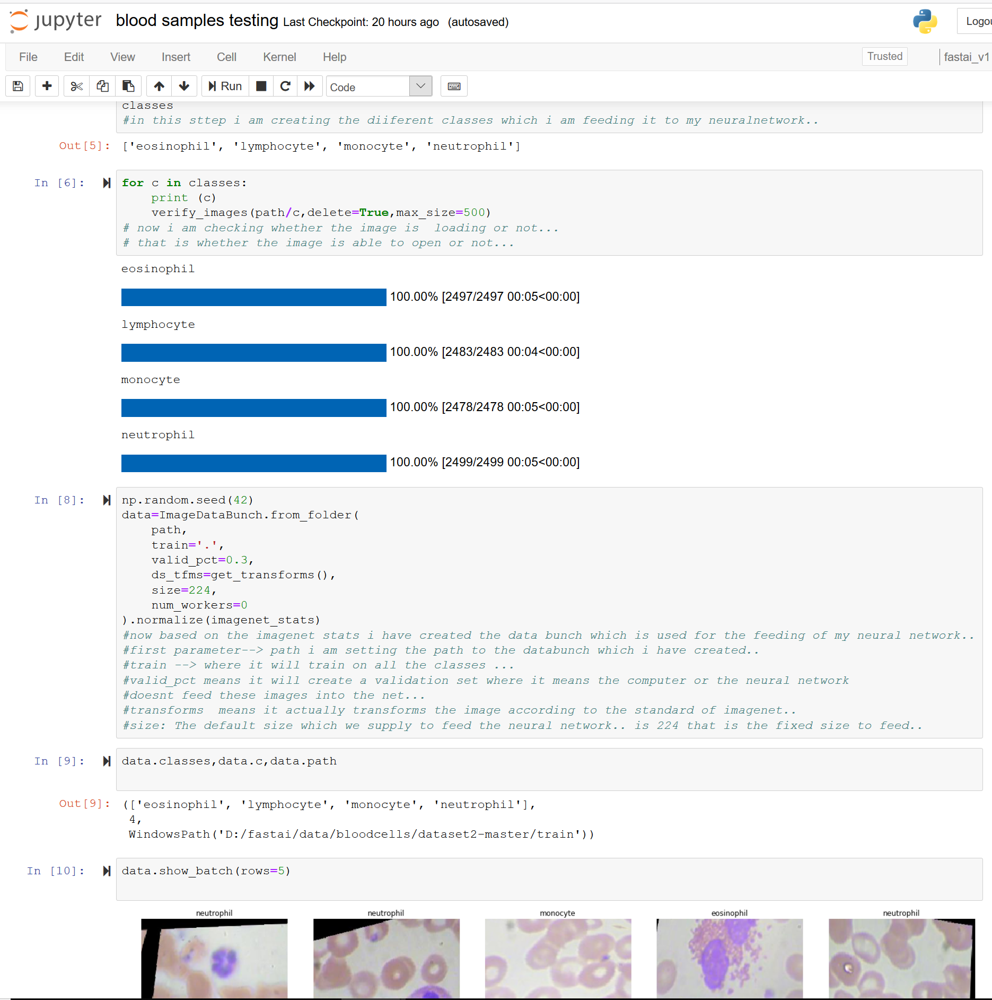
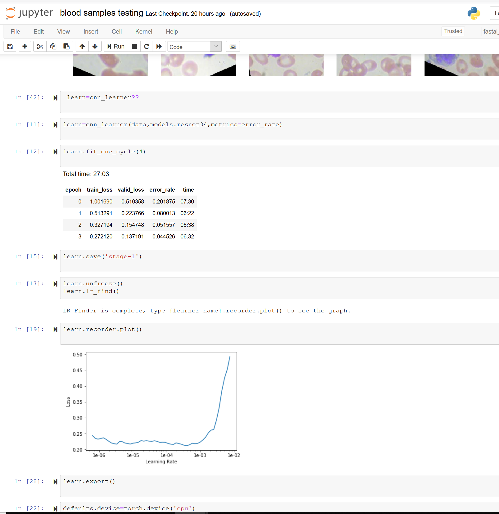

# Blood-cell-detection-using-supervised-learning
In this notebook you will find the sted by step method of how  to classsify the blood samples... using the supervised learning method..
and it is a classification problem where when you give any image to the model then it gives the predicted output based on the data i provided to it...
and i have used pretrained model where it uses the fastai library.. and the model learning rate was 95.5%... and it can be used to detect 
whether the given test photo is nueclophile or esinophil etc..

# required libraries --fastai library
# This is the cleaning of the dataset and preparing it for the learning

# after training the model looks like the following with training accuracy...

